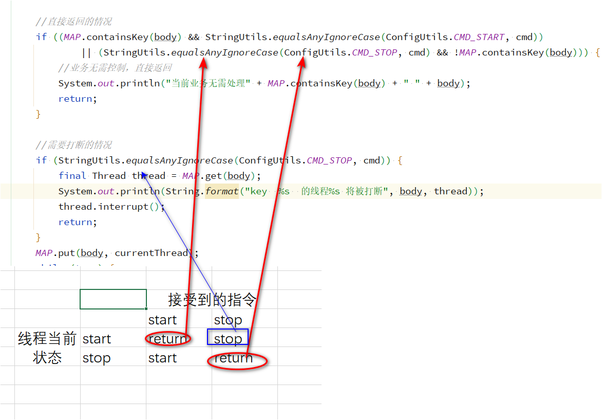

java -jar springboot-demo.jar --spring.profiles.active=test

nohup java -jar -Dspring.profiles.active=test springboot-demo.jar &

## 多线程处理业务控制处理

控制业务的开启和停止。停止的时候打算开启的线程。开的时候，如果已经开启了，则忽略。

删除源码 java -jar execJar-0.0.1-SNAPSHOT.jar -d {spring-*-source.jar目录}

